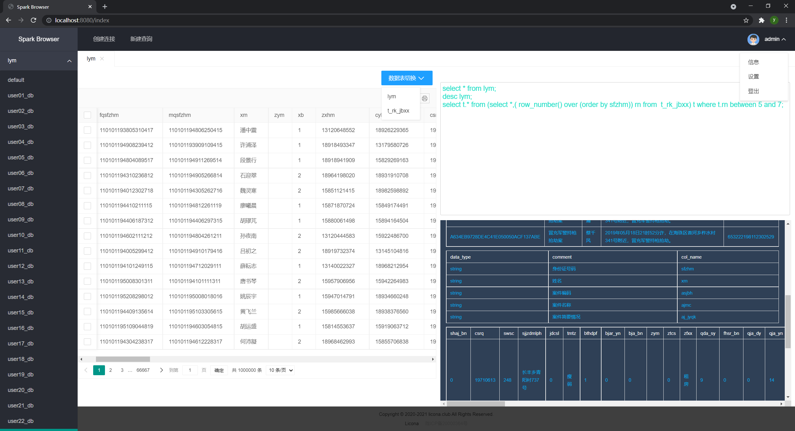

# 2021-Big-data-development

## 第一周 文件同步器

### 效果展示

```
----------------------------首先我们处理之前程序运行时候断点下载问题-------------------------------
被中断的文件名称: test/test-multipartupload
我们从根据本地文件大小来从未下载部分开始继续下载文件
目前已下载test-multipartupload百分比:26.89828342980391%
Downloading part 1
Downloading part 2
Downloading part 3
68743067
Completing download
save test/test-multipartupload to C:/liyuming-repository/
----------------------------断点续传之下载问题处理完成------------------------------
----------------------------之后我们处理之前程序运行时候断点上传问题-------------------------------
test/test-multipartupload
Created upload ID was 2~2v33HyTns0NWMiYKKzzP-2V7EX9hFRf
Uploading part 4
Completing upload
Done!
----------------------------断点上传问题处理完成------------------------------
---------------之后我们将Bucket文件同步到本地并解决相关冲突-----------------
source/code-docs/package.json
Downloading part 1
Completing download
save source/code-docs/package.json to C:/liyuming-repository/source/code-docs/package.json
Done!
--------------------------同步到本地已经完成----------------------------
---------------开始执行同步本地文件到远程操作-----------------
首先，我们上传本地添加或修改的文件到远程库-----------------
本地修改的文件处理成功，文件名称为: 
source/code-docs/package-lock.json
本地添加的文件处理成功，文件名称为: 
source/local_add
之后，我们处理本地删除的文件------------------
---------------同步本地文件到远程已经完成，程序将睡眠30s，之后会对文件再次扫描-----------------
---------------开始执行同步本地文件到远程操作-----------------
首先，我们上传本地添加或修改的文件到远程库-----------------
本地添加的文件处理成功，文件名称为: 
source/code-docs/ApiPost.lnk
本地修改的文件处理成功，文件名称为: 
source/code-docs/package-lock.json
之后，我们处理本地删除的文件------------------
本地删除的文件处理成功，文件名称为: 
source/code-docs/package.json
---------------同步本地文件到远程已经完成，程序将睡眠30s，之后会对文件再次扫描-----------------
---------------开始执行同步本地文件到远程操作-----------------
首先，我们上传本地添加或修改的文件到远程库-----------------
Created upload ID was 2~L2XolyCg5XX92zD4suMQbZnpvVmbjXD
Uploading part 1
Uploading part 2
Completing upload
c8fcccd82d6110a223f2fc71ba0ff123
19132618eb4eccfe2b49f56022920015
Done!
本地添加的文件处理成功，文件名称为: 
big_file - 副本
之后，我们处理本地删除的文件------------------
---------------同步本地文件到远程已经完成，程序将睡眠30s，之后会对文件再次扫描-----------------
```

## 第二周 Spark SQL查询分析器

### 效果展示



## 第三周 流式计算小案例

## 第四周 人工智能小案例

## 第五周 数据治理操作

