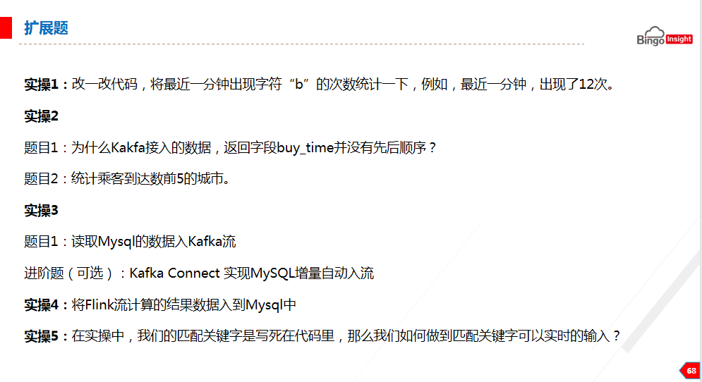
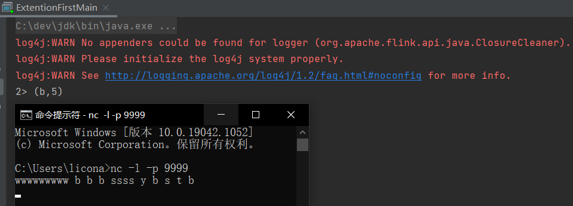
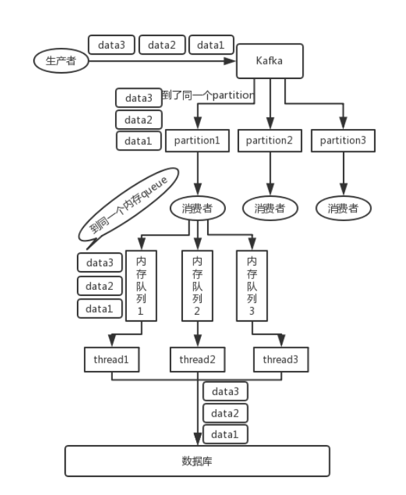
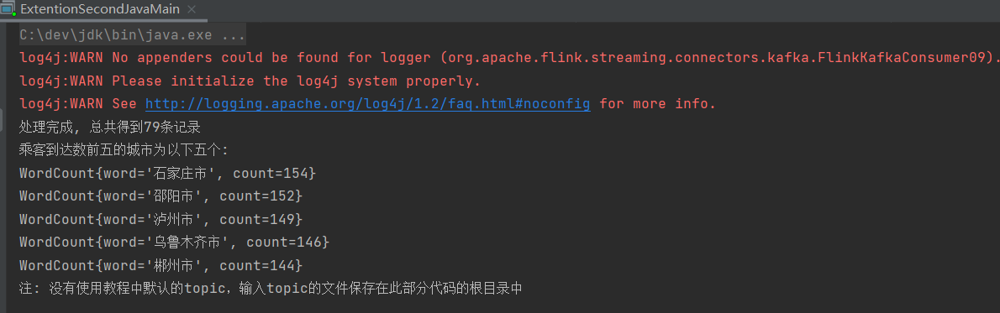
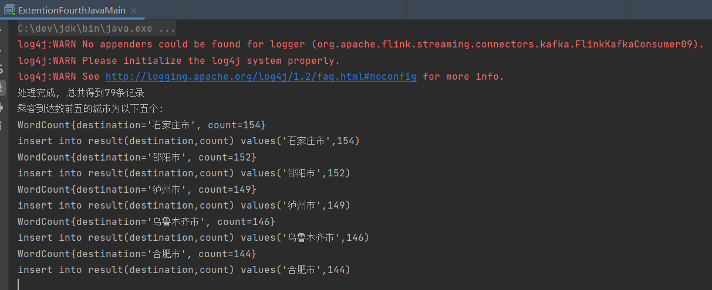
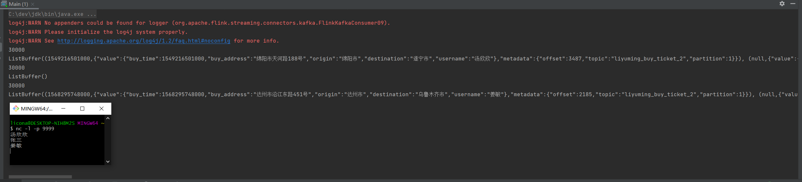
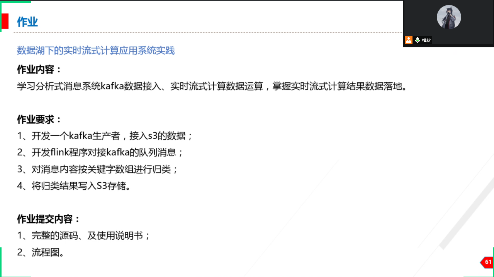

#### java扩展题



##### 实操1
改一改代码，采用flink将最近一分钟出现字符"b"的次数统计一下，例如，最近一分钟，出现了12次
**steps:**

```
1.启动nc.exe，Linux or Mac:nc -l 9999 Windows:nc -l -p 9999
2.val text = env.socketTextStream("localhost", 9999) 监听9999端口
3.按空格分割，并过滤出包含目标字符的元素，之后统计目标字符在一分钟内出现的次数
val stream = text.flatMap {
  _.toLowerCase.split("\\W+") filter {
    _.contains(target)
  }
}.map(x => (x, 1)).keyBy(0).timeWindow(Time.seconds(60))
  .sum(1);
```
**result:**


##### 实操2

###### 题目1

为什么kafka接入的数据，返回字段buy_time并没有先后顺序

buy_time 如果插入时候有先后顺序，那么在读取时候我们设置并行度为1就会得到有序的数据

```
inputKafkaStream.print().setParallelism(1)
```



###### 题目2

统计乘客到达数前五的城市

**steps:**

```java
1.对数据进行预处理，得到List<WordCount(destination,1)>
DataStream<WordCount> wordCountSingleOutputStreamOperator = stringDataStreamSource.flatMap(new FlatMapFunction<String, WordCount>() {
    public void flatMap(String line, Collector<WordCount> collector) throws Exception {
        String destination = null;
        if(line.contains("\"")) {
            destination = line.split(",")[3].split(":")[1].replace("\"", "");
        } else if(line.contains(",")) {
            destination = line.split(",")[3].split("=")[1];
        }
        collector.collect(new WordCount(destination, 1L));
    }
});
2.通过ProcessAllWindowFunction来计算topN
SingleOutputStreamOperator<WordCount> topN = wordCountSingleOutputStreamOperator
        .keyBy("destination")
        .windowAll(TumblingProcessingTimeWindows.of(Time.seconds(5)))
        .process(new ProcessAllWindowFunction<WordCount, WordCount, TimeWindow>() {
            @Override
            public void process(Context context, Iterable<WordCount> iterable, Collector<WordCount> collector) {
                // 合并word相等的WordCount对象
                List<WordCount> list = new ArrayList<>();
                for (WordCount wordCount : iterable) {
                    for (int i = 0; i < list.size(); i++) {
                        if((list.get(i).destination).equals(wordCount.destination)) {
                            list.set(i, new WordCount(list.get(i).destination, list.get(i).count + 1));
                        }
                    }
                    if(!list.contains(wordCount)) {
                        list.add(wordCount);
                    }
                }

                // 对结果进行排序
                list.sort((o1, o2) -> (int) (o2.count - o1.count));


                System.out.println("处理完成, 总共得到" + list.size() + "条记录");
                System.out.println("乘客到达数前五的城市为以下五个: ");

                for (int i = 0; i < 5; i++) {
                    System.out.println(list.get(i));
                    collector.collect(list.get(i));
                }
                System.out.println("注: 没有使用教程中默认的topic，输入topic的文件保存在此部分代码的根目录中");
            }
        });
  
```

**result:**



注：以上结果为java代码输出结果，scala代码输出结果与此相同

##### 实操3

###### 题目1

读取MySQL的数据入kafka流

**steps**

```java
1.创建工具类，读取mysql中的数据并且以List<Map>格式返回
 public static List<Map<String, Object>> executeQuery(Connection connection, String sql) {
        PreparedStatement preparedstatement = null;
        ResultSet rs = null;

        List<Map<String, Object>> list = new ArrayList<Map<String, Object>>();

        try {
            preparedstatement = (PreparedStatement) connection.prepareStatement(sql);

            rs = preparedstatement.executeQuery();
            // 获取元数据
            ResultSetMetaData rsmd = rs.getMetaData();
            Map<String, Object> mapMetaData = new HashMap<String, Object>();
            // 打印一列的列名
            while (rs.next()) {
                //获取数据表中满足要求的一行数据，并放入Map中
                for (int i = 0; i < rsmd.getColumnCount(); i++) {
                    String columnLabel = rsmd.getColumnLabel(i + 1);
                    Object columnValue = rs.getObject(columnLabel);
                    mapMetaData.put(columnLabel, columnValue);
                }
                Map<String, Object> tmpMap = new HashMap<>();
                //将Map中的数据通过反射初始化T类型对象
                if (mapMetaData.size() > 0) {
                    for (Map.Entry<String, Object> entry : mapMetaData.entrySet()) {
                        tmpMap.put(entry.getKey(), entry.getValue());
                    }
                }
                //将对象装入Vector容器
                list.add(tmpMap);
            }
            rs.close();
            preparedstatement.close();
        } catch (Exception e) {
            e.printStackTrace();
        }
        return list;
    }
2.将读取到的map数据写入kafka
maps.forEach(stringObjectMap -> {
    System.out.println(process(stringObjectMap));
    ProducerRecord producerRecord = new ProducerRecord(topic, null, process(stringObjectMap));
    kafkaProducer.send(producerRecord);
});
```

**result**

```
之后读取kafka的数据可以确定数据已经从mysql写入kafka指定主题中
```

###### 进阶题(可选)：Kafka Connect 实现MySQL增量自动入流

https://docs.confluent.io/debezium-connect-mysql-source/current/index.html

经验证，此方法可以实现MYSQL增量自动入流

mysql  ----->   Debezium   ----->   Kafka 

[Debezium’s MySQL Connector](https://debezium.io/docs/connectors/mysql/) is a source connector that can record events for each table in a separate Kafka topic, where they can be easily consumed by applications and services.

##### 实操4

将Flink流计算的结果入到MySQL中

计算乘客到达数前五的城市并且将其写入MySQL表中

**steps**

```java
1.计算乘客到达数前五，见前述题目
2.运行MYSQL插入命令工具类
public static boolean execute(Connection connection, String sql) throws SQLException {
    PreparedStatement preparedstatement = null;
    preparedstatement = connection.prepareStatement(sql);
    return preparedstatement.execute();
}
3.将计算结果写入到mysql中
// 之后我们将结果数据存储到MySQL中的result表中
MysqlUtil.execute(connection, "delete from result");
    for (int i = 0; i < 5; i++) {
        System.out.println(list.get(i));
        String sql = "insert into result(destination,count) values('" + list.get(i).destination + "'," + list.get(i).count + ")";
        System.out.println(sql);
        MysqlUtil.execute(connection, sql);
        collector.collect(list.get(i));
}
```

**result**:



最终可以在数据库中看到相关记录

##### 实操5

在实操中，我们的匹配关键字是写死在代码里，那么我们如何做到匹配关键字可以实时地输入?

**steps**

```java
1.通过socket实时监听得到的数据，并通过connect来拿着通过socket获得的数据匹配从kafka中读取到的数据
    val inputKafkaStream = env.addSource(kafkaConsumer)

    val text = env.socketTextStream("localhost", 9999)


    text.connect(inputKafkaStream).process(new CoProcessFunction[String, ObjectNode, String] {
      val list = new ListBuffer[JsonNode]

      override def processElement1(in1: String, context: CoProcessFunction[String, ObjectNode, String]#Context, collector: Collector[String]): Unit = {
        println(list.size)
        if (list.size > 0) {
          val ans = list.filter(x => x.get("value").get("username").asText("").equals(in1)).map(x => {
            (x.get("metadata").get("topic").asText("") match {
              case "mn_monitoring_1"
              => x.get("value").get("found_time")
              case _ => x.get("value").get("buy_time")
            }, x)
          })
          println(ans)
        }
      }

      override def processElement2(in2: ObjectNode, context: CoProcessFunction[String, ObjectNode, String]#Context, collector: Collector[String]): Unit = {
        list.append(in2)
      }
    })
```

**result**



#### 作业



##### 1.开发一个kafka生产者，接入s3的数据

**stpes:**

```java
1.从s3中读取文件
  /**
   * 从s3中读取文件内容
   *
   * @return s3的文件内容
   */
  def readFile(): String = {
    val credentials = new BasicAWSCredentials(accessKey, secretKey)
    val clientConfig = new ClientConfiguration()
    clientConfig.setProtocol(Protocol.HTTP)
    val amazonS3 = new AmazonS3Client(credentials, clientConfig)
    amazonS3.setEndpoint(endpoint)
    val s3Object = amazonS3.getObject(bucket, key)
    IOUtil.getContent(s3Object.getObjectContent, "UTF-8")
  }
2.将数据写入kafka中
  /**
   * 把数据写入到kafka中
   *
   * @param s3Content 要写入的内容
   */
  def produceToKafka(s3Content: String): Unit = {
    val props = new Properties
    props.put("bootstrap.servers", bootstrapServers)
    props.put("acks", "all")
    props.put("key.serializer", "org.apache.kafka.common.serialization.StringSerializer")
    props.put("value.serializer", "org.apache.kafka.common.serialization.StringSerializer")
    val producer = new KafkaProducer[String, String](props)
    val dataArr = s3Content.split("\n")
    for (s <- dataArr) {
      if (!s.trim.isEmpty) {
        val record = new ProducerRecord[String, String](topic, null, s)
        println("开始生产数据：" + s)
        producer.send(record)
      }
    }
    producer.flush()
    producer.close()
  }
```

##### 2.开发flink程序对接kafka的队列消息，对消息内容按照关键字数组进行归类，将归类结果写入s3存储

**steps:**

```java
1.按照时间进行归类
   // 2019-06-20 00:40:16 => 1560962416
    val past = inputKafkaStream.filter(item => {
      TimeCompare(tranTimeToString(item.get("value").get("buy_time").toString), "2019-06-20 00:40:16")
    })
    val cur = inputKafkaStream.filter(item => {
      TimeCompare("2019-06-20 00:40:16", tranTimeToString(item.get("value").get("buy_time").toString))
    })
    past.writeUsingOutputFormat(new S3Writer(accessKey, secretKey, endpoint, bucket, pastKeyPrefix, period))

    cur.writeUsingOutputFormat(new S3Writer(accessKey, secretKey, endpoint, bucket, curKeyPrefix, period))
    env.execute()
  }

  def tranTimeToString(tm: String): String = {
    val fm = new SimpleDateFormat("yyyy-MM-dd HH:mm:ss")
    val tim = fm.format(new Date(tm.toLong))
    tim
  }

  def TimeCompare(buyTime: String, constantTime: String): Boolean = {
    var flag = false
    val df: DateFormat = new SimpleDateFormat("yyyy-MM-dd HH:mm:ss")
    try {
      val buy: Date = df.parse(buyTime)
      val constant: Date = df.parse(constantTime)

      val bs: Long = buy.getTime - constant.getTime
      if (bs < 0) {
        flag = true
      }
    }
    catch {
      case e: Exception => {
      }
    }
    flag
  }
```

##### 3.使用说明书

[使用说明书](./kafka-producer-flink-consumer/使用说明书.md)

##### 4.流程图

[流程图](./kafka-producer-flink-consumer/流程图.md)

