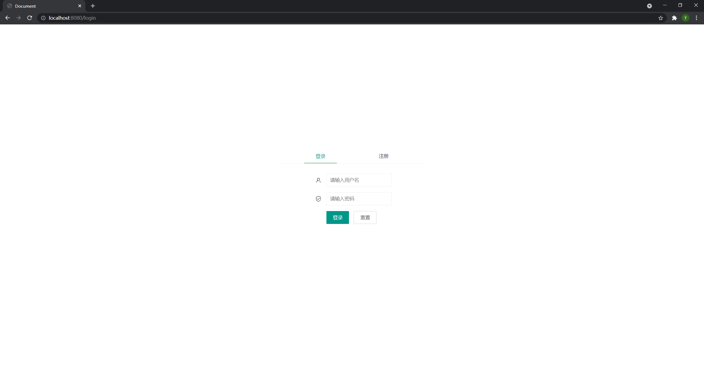
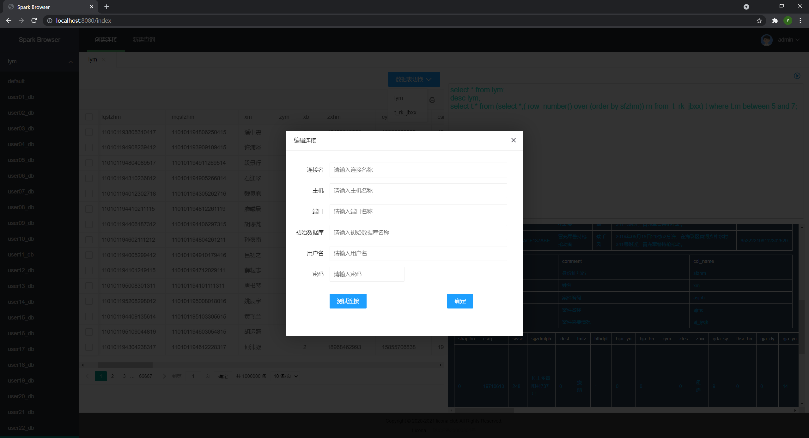

### spark-desktop-browser
#### 部署

##### 配置MySQL
1.修改application.yml中关于数据库的相关配置
2.在第一步连接的数据库中创建如下表格
```sql
create table connection
(
    id                       bigint auto_increment
        primary key,
    uid                      bigint      not null,
    connection_name          varchar(20) not null,
    connection_host          varchar(32) null,
    connection_port          varchar(8)  null,
    connection_database_name varchar(20) null,
    connection_username      varchar(20) null,
    connection_password      varchar(16) null,
    constraint connection__id_fk
        foreign key (uid) references user (id)
);

create table user
(
    id       bigint auto_increment
        primary key,
    username varchar(12) not null,
    password varchar(12) not null,
    constraint table_name_username_uindex
        unique (username)
);
```
##### 部署springboot项目

#### 演示


