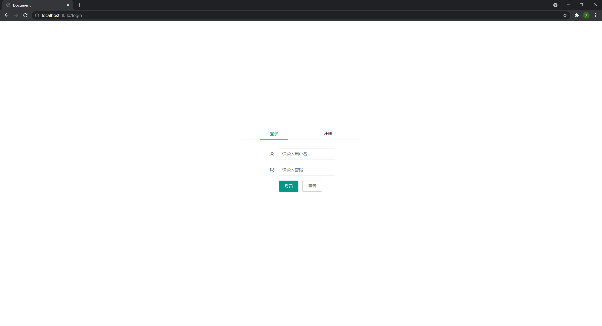

### 使用说明书

##### 1.使用步骤

1.首先需要部署项目，详细部署教程见代码中的 [README](./spark-desktop-server/README.md)文档

1.访问http://localhost:8080/index页面会因为没有用户token跳转到login页面，如果没有账号，请先点击注册按钮进行注册，然后进行登录

2.登录成功后点击创建连接输入spark相关信息后执行测试连接，如果可以连接，点击确定加入此连接到自己的账户中

3.在创建完成自己的连接之后就可以在侧边栏看到自己创建好的连接，点击连接名称，如果可以正常连接的话，会生成子菜单，打开后可以看到此连接下的所有数据库

4.如何想要修改当前连接的主机号，用户名等信息，可以点击上方菜单栏中的编辑连接进行修改，演示如下

5.点击侧边栏中展开的数据库，会将此数据库中的所有表格渲染在数据表切换选择框中

6.点击想要查看的数据表，会将数据表的详细内容渲染在左半部分界面中，每页最多显示15条数据，切换页面后会重新发送网络请求获取数据，也就意味着不会一次性获取表中所有数据。

7.用户可以依照左边查询得到的结果在右上角编辑框中编写sql代码对数据库进行相关操作，运行后的结果会展示在右下角中，对于没有返回值的语句，如果执行成功会输出true，反之为false；对于有返回值的结果，会以表格的形式渲染在页面中。