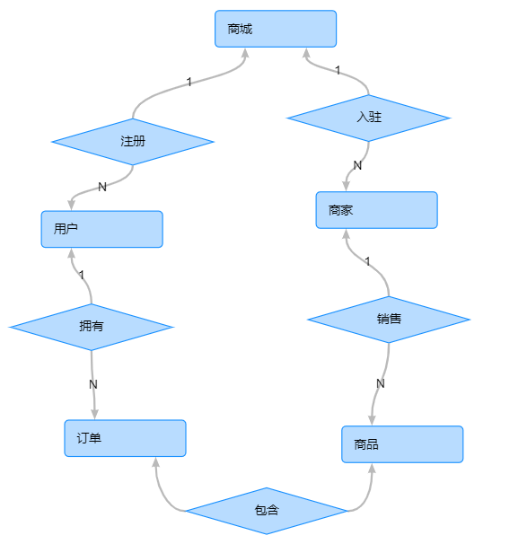

网上商城场景类似京东，天猫；

商城注册很多用户；

商城入驻很多商家；

商家可以售卖很多商品；

用户可以在商城购买商品；

#### 1.业务系统物理模型，数据仓库物理模型




#### 2.需求

##### 2.1.按月查看总体销售额，新增注册人数；

```sql
# 1.1.按月查看总体销售额
select created, sum(total_amount) as sell_total
from sell_order_main
where MONTH(created) = 6;
```

```sql
# 1.2.新增注册人数
select count(*) as user_sell_count
from (select count(id) from mall_user union all select count(id) from mall_seller where MONTH(created) = 7) as mucmsc;
```

##### 2.2.按月查看城市的销售额(收货城市)；

```sql
# 2.1.按月查看城市的销售额
select created, destination, sum(total_amount) as sell_total
from sell_order_main
where MONTH(created) = 6
  and destination = '乌拉巴托';
```

##### 3.1.按月查看城市，商品类别的销售额（两个纬度：城市，商品类别）

```sql
select destination, p.name, sum(sell_price * amount) as sell_total
from sell_order_main as m
         inner join sell_order_details as d on m.id = d.order_main_id
         inner join product p on d.product_id = p.id
where MONTH(m.created) = 7
group by p.name, destination;
```

##### 4.1.按月查看性别，商品类别的销售额（两个纬度：性别，商品类别）

```sql
# 4.1.按月查看性别，商品类别的销售额（两个纬度：性别，商品类别）
select mu.sex, p.name, MONTH(d.created) as month, sum(d.amount * d.sell_price) as sum
from mall_user mu
         inner join sell_order_main so on so.customer_id = mu.id
         inner join sell_order_details as d on mu.id = d.order_main_id
         inner join product p on d.product_id = p.id
where MONTH(so.created) = 7
group by mu.sex, p.name;
```

##### 3.上述需求SQL

原始sql见2

平台服务接口见下方或数据治理平台->数据服务


##### 4.用数据质量任务核查手机号格式不正确的，邮件地址格式错误的，年龄小于18岁的

见网站质量检测模块


